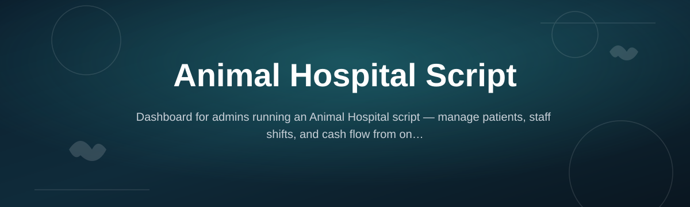
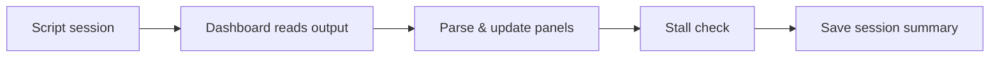

# animal-hospital-script-mc-dashboard

*A dashboard for the Animal Hospital Script that turns a messy simulator run into something you can actually read.*

## What this is

**animal-hospital-script-mc-dashboard** is a standalone Windows companion built around the Animal Hospital Script — the kind of automation script people run alongside the popular vet-clinic tycoon experience to track progress instead of babysitting a window all day. Rather than replacing the script, this dashboard sits next to it and gives you a live, readable view of what's actually happening: patients processed, currency earned, session uptime, and the small anomalies that usually go unnoticed until something breaks.

The project started because the original script output was just scrolling console text — useful, but painful to monitor over long sessions. This dashboard reorganizes that same information into a clean panel, adds session history so you can compare runs, and flags obvious stalls so you're not staring at a frozen screen wondering if it's still working. It's aimed at people who already use the Animal Hospital Script and want a better way to watch it run.

The full story — why this exists

 

This began as a personal script wrapper. The original Animal Hospital Script worked fine, but every session looked the same: a terminal window full of scrolling text, no history, no way to tell at a glance whether things were progressing or quietly stuck. A few of us in a small Discord kept comparing screenshots to check whose run was doing better, which is a silly way to track anything.

The dashboard came out of wanting one screen that answered "is this working right now" without reading logs. Early versions were rough — a single-file panel that just parsed script output. Over time it grew session comparisons, stall detection, and a settings pane, mostly based on requests from people using it daily.

It's still a companion tool, not a replacement for the script itself, and it's built to stay that way. Contributions, bug reports, and small feature requests are welcome — several of the current panels exist because someone opened an issue asking for exactly that.

  

The button above opens the project page where you can download the latest build.

## Who it is for

- **Players who already run the Animal Hospital Script** and want a clearer view of long sessions
- **Group or community leads** tracking multiple people's runs and comparing results
- **New contributors** looking for a small, approachable Windows project to learn from
- **Anyone tired of reading raw console output** and wanting numbers laid out visually
- **Casual users** who leave sessions running in the background and just want a status check

## What you can do

- **Watch live session stats** — patients handled, earnings, and elapsed time in one panel
- **Compare past sessions** — a simple history view instead of screenshots and guesswork
- **Get stall alerts** — the dashboard flags when script output stops updating unexpectedly
- **Adjust refresh intervals** — tune how often the dashboard polls for new data
- **Export session summaries** — save a run's numbers as a plain text file
- **Switch between light and dark panels** — for long sessions at any hour
- **Run without installation** — a single executable, no setup wizard
- **Keep settings between runs** — your layout and preferences persist automatically

## Getting started

1. Open the [project page](https://quantumskyruin68.github.io/animal-hospital-script-mc-dashboard/).
2. Download the latest release for Windows.
3. Extract the folder anywhere convenient — no installer runs.
4. Launch the executable and point it at your Animal Hospital Script session.
5. Leave it running alongside your normal script setup.

## Requirements

- Windows 10 or Windows 11 (64-bit)
- No build tools, runtimes, or package managers needed
- A working Animal Hospital Script session to monitor
- Roughly 100 MB of free disk space

## How it works

1. The dashboard launches and looks for an active Animal Hospital Script session.
2. It reads session output on a fixed interval you can adjust.
3. New data is parsed and pushed into the live panels — stats, timers, alerts.
4. If output stops arriving past a threshold, a stall warning appears.
5. On close, the session summary is saved to history for later comparison.

## FAQ

**Does this replace the Animal Hospital Script itself?**
No. It's a monitoring companion — you still run the script separately; the dashboard just reads its output.

**Why does the dashboard show no data after launch?**
It usually means the script session hasn't started yet, or the refresh interval hasn't triggered its first poll. Give it a few seconds after launch.

**Can I use this on Mac or Linux?**
Not currently. The build targets Windows 10/11 only.

**Will this affect my script's performance?**
No — the dashboard only reads output, it doesn't modify script behavior or timing.

**Where do I report a bug or request a feature?**
Open an issue on the repository. Most existing panels started as exactly that kind of request.

## Troubleshooting

**Dashboard opens but shows a blank panel** — confirm the Animal Hospital Script session is actually running before launching the dashboard; it needs live output to display.

**Stall warning appears even though the script is working** — increase the refresh interval in settings; a low interval can misfire on slower systems.

**Executable won't launch** — make sure the folder wasn't partially extracted and that Windows hasn't quarantined the file; check your antivirus quarantine list.

**Session history is empty** — history only saves on a clean close; force-closing the window skips the summary step.

## License

Released under the [MIT License](LICENSE). This is a community-maintained companion project and isn't affiliated with any official game or script publisher. Use it at your own discretion.

  

